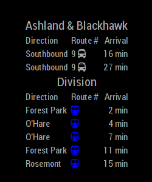

# MMM-CTA



This [MagicMirror Module][mm] is designed to display incoming bus and train times for the CTA (Chicago Transit Authority).  The module will display up to the minute data for bus and train arrival times.

## Get your CTA API keys!

You need to obtain API keys to access the live data to update your mirror:

Bus API:  http://www.transitchicago.com/developers/bustracker.aspx

Train API:  http://www.transitchicago.com/developers/traintrackerapply.aspx

The bus tracker API key can be obtained immediately, the train tracker key can take a few days to register.  Please reference this github since it's already approved maybe it will help speed things along for you.

## Installation

In your terminal, go to your MagicMirror's Module folder:

```bash
cd ~/MagicMirror/modules
```
Clone this repository:
```bash
git clone https://github.com/NateDee/MMM-CTA.git
```
Configure the module in your config.js file.


## Using the module

To use this module, add it to the modules array in your config.js file.

```js
modules: [
     {
	module: 'MMM-CTA',
	position: 'bottom_left',
	config: {
		updateTime: 60000, // 1 minute, the API does not update much more often so going below this is unnecessary
		ctaApiKey: 'you-bus-APIkey',
		busStopName: '',  // String value, Name your bus stop
		stopId: 561, // Bus station ID: Chicago and Milwaukee example; go to http://www.transitchicago.com/riding_cta/systemguide/default.aspx to find your stop ID
		maxResult: 4,  // The maximum number of incoming bussesy you want to display for bus stops
		ctaApiKeyTrain: 'your-train-APIkey',
		trainStopName: '',  //String value, name your train stop
		trainStationID: 41410, //Train station ID:  Chicago Blue line example; http://www.transitchicago.com/developers/ttdocs/default.aspx#_Toc296199909
		maxResultTrain: 5, // Max number of incoming trains to disply
		moduleInstance: 1, // To run multiple instances of this module
	},
     }
]
```

## Configuration Options

Option|Description
------|-----------
`updateTime`|How often the requests should update; 60 * 1000 = 1 minute.<br/>**Expected Value type:** `int`
`ctaApiKey`|Your CTA Bus API key.<br/>**Expected Value type:** `string`
`busStopName`|Name you would like to give your bus stop.<br/>**Expected Value type:** `string`
`stopId`|The number of your stopID, find a stop ID:<br/>http://www.transitchicago.com/riding_cta/systemguide/default.aspx<br/>For help finding your stopID, see the FAQ below.<br/>**Expected Value type:** `int`
`maxResult`|The maximum number of bus results your station should display.<br/>**Expected Value type:** `int`
`ctaApiKeyTrain`|Your CTA Traing API key.<br/>**Expected Value type:** `string`
`trainStopName`|Name you would like to give your train stop.<br/>**Expected Value type:** `string`
`trainStationID`|Number of L station, find a station:<br/>http://www.transitchicago.com/developers/ttdocs/default.aspx#_Toc296199909<br/>**Expected Value type:** `int`
`maxResultTrain`|The maximum number of train results to display.<br/>**Expected Value type:** `int`
`moduleInstance`|If running multiple instances, add a new instance to your config.js and increment this value by 1 for each additional instance.<br/>**Expected Value type:** `int`


## FAQ
- I can't find my bus stop ID
	
	Follow the link in "Configuration Options", use the drop down menu to find your bus route.  Under "Route Information", click the "Bus Stop List" link, which provides a table of StopID's matching the stop name and direction of travel.
	
- I can't find my train station ID

	Follow the link in "Configuration Options", scroll down to the section titled "Parent Stop ID Quick Reference" and find your stationID.  The table is labeled as StopID, but these are actually the StationID's.
	
- I want more or different config options
	
	Create an issue here please.

[mm]: https://github.com/MichMich/MagicMirror
